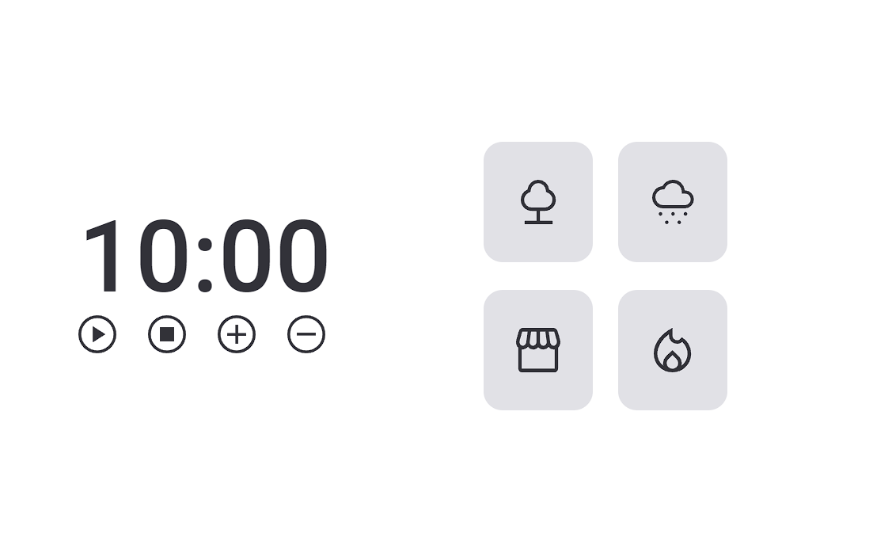

<h1 align="center"> Temporizador pomodoro 2.0 </h1>

Evento exclusivo , promovido pela Rocketseat para ensino de tecnologias WEB.

  <a href="#-tecnologias">Tecnologias</a>&nbsp;&nbsp;&nbsp;|&nbsp;&nbsp;&nbsp;
  <a href="#-projeto">Projeto</a>&nbsp;&nbsp;&nbsp;|&nbsp;&nbsp;&nbsp;
  <a href="#-layout">Layout</a>&nbsp;&nbsp;&nbsp;|&nbsp;&nbsp;&nbsp;
  <a href="#-aprendizado">Aprendizado</a>&nbsp;&nbsp;&nbsp;|&nbsp;&nbsp;&nbsp;
  <a href="#memo-licença">Licença</a>

  

 

  

## 🚀 Tecnologias

Esse projeto foi desenvolvido com as seguintes tecnologias:

- HTML e CSS
- JavaScript
- Git e GitHub

## 💻 Projeto

Projeto com o objetivo de decrementar o tempo sendo ele fornecido ou não, possuindo as mesmas funcionalidades e características de um temporizador. Além disso pode incrementar ou decrementar 5 minutos no temporizador .

## 🔖 Layout

Você pode visualizar o layout do projeto através [DESSE LINK](https://www.figma.com/file/Pw8yMsK7HFkD6aISZt6gPA/Stage-05---Focus-Timer-2.0/duplicate). É necessário ter conta no [Figma](https://figma.com) para acessá-lo.  

## 🧠 Aprendizado

Nesse projeto eu aprendi;

- ES6 Modules.
- Manipulação com a DOM.
- Eventos.
- Funções CallBack.
- Refatoração de código.
- Clean Code.
- Injeção de dependências.
- Object literals.
- Factory function.

## :memo: Licença

Esse projeto está sob a licença MIT.

---
